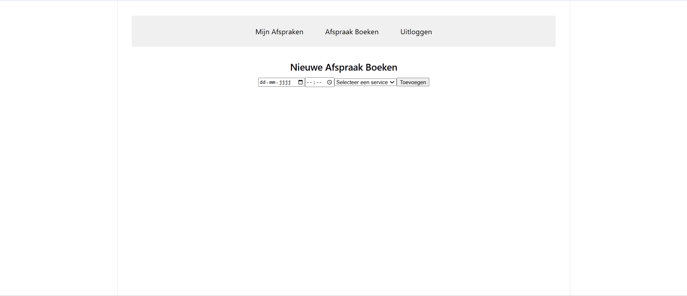

# MERN Barber App
 
Fullstack barber app gebouwd met de MERN stack (MongoDB, Express, React, Node.js).
 
---
 
## Installatie
 
Zorg dat je dit al hebt geïnstalleerd:
 
- [Node.js](https://nodejs.org) (versie v22 of hoger — download de LTS versie)
- npm (komt automatisch mee met Node.js)
- Git
 
Weet je niet zeker of je het al hebt? Open je terminal en typ:
 
```bash
node --version
npm --version
```
 
Het zit goed als je een versienummer ziet.
 
---
 
### Clone het project
 
```bash
git clone https://github.com/lisamast/mern-barber.git
```
 
Open daarna de map in VS Code:
 
```bash
cd mern-barber
code .
```
 
---
 
### Stap 2 — Backend instellen
 
Ga naar de backend map:
 
```bash
cd backend
```
 
Installeer alle packages:
 
```bash
npm install
```
 
Maak een `.env` bestand aan in de `backend` map en zet dit erin:
 
```
PORT=4000
MONGO_URI=jouw-mongodb-link-hier
NODE_ENV=development
```
 
> Let op: Zet je echte MongoDB link in `MONGO_URI`. Maak je gratis database aan op [mongodb.com](https://www.mongodb.com/atlas).
> Push het `.env` bestand niet naar GitHub — daar staan je wachtwoorden in!
 
---
 
### Stap 3 — Frontend instellen
 
Open een nieuw terminal venster en ga naar de frontend map:
 
```bash
cd frontend
```
 
Installeer alle packages:
 
```bash
npm install
```
 
---
 
## App starten
 
Je hebt twee terminals nodig — één voor de backend en één voor de frontend.
 
### Terminal 1 — Backend starten
 
```bash
cd backend
npm run dev
```
 
Je ziet dit als het goed gaat:
 
```
Server draait op http://localhost:4000
```
 
### Terminal 2 — Frontend starten
 
```bash
cd frontend
npm run dev
```
 
Open daarna je browser en ga naar:
 
```bash
http://localhost:5173
```
 
> De backend en frontend moeten allebei draaien anders werkt de app niet
 
---
 
## Screenshot
 

 
---